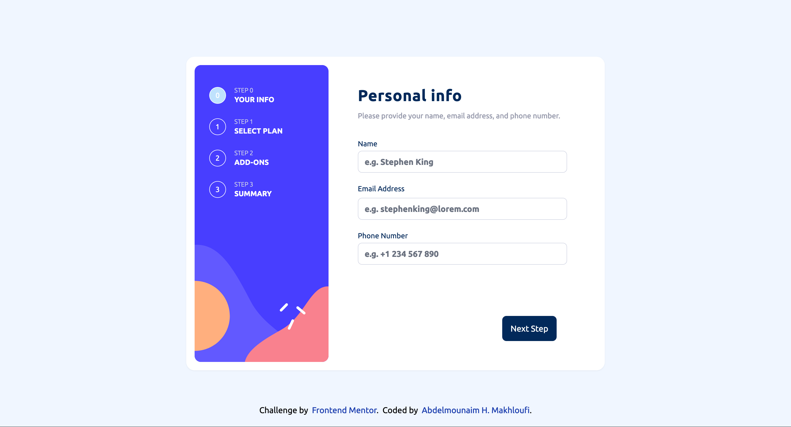
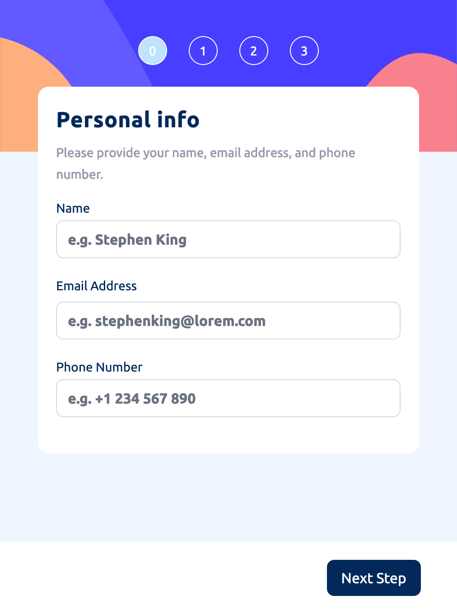
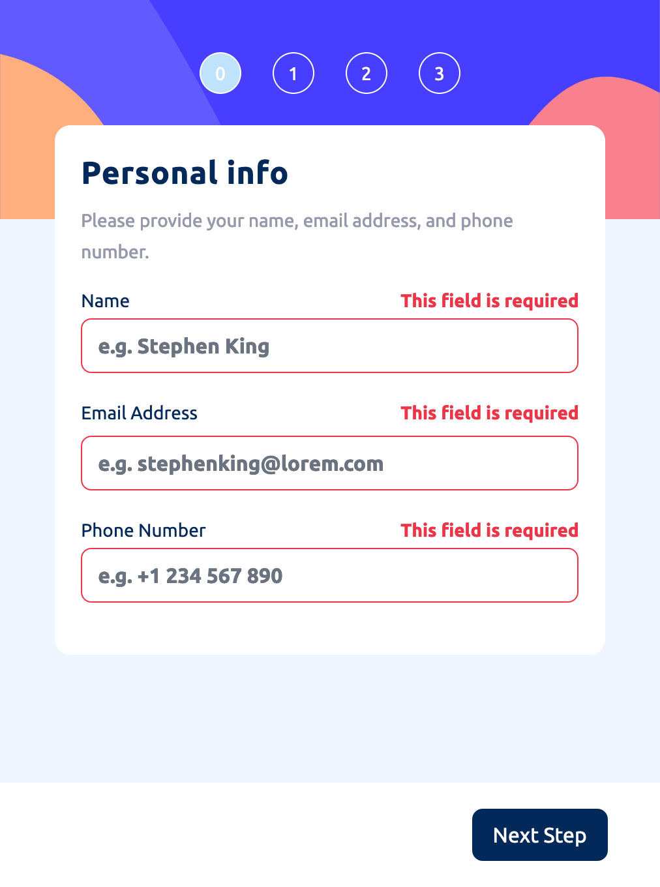

# Frontend Mentor - Loopstudios landing page solution

This is a solution to the [Loopstudios landing page challenge on Frontend Mentor](https://www.frontendmentor.io/challenges/loopstudios-landing-page-N88J5Onjw).

## Table of contents

- [Overview](#overview)
  - [Screenshot](#screenshot)
  - [Links](#links)
- [My process](#my-process)
  - [Built with](#built-with)
- [Author](#author)

## Overview

### Screenshot

### Links

- Solution URL: [Solution URL](https://github.com/HassanMak29/frontend-mentor-loopside-landing-page)
- Live Site URL: [Live site URL](https://frontend-mentor-loopstudios-landing.netlify.app/)

### Built with

- Semantic HTML5 markup
- Flexbox
- Desktop-first workflow
- [Vite](https://vite.dev/) - JS tool
- [Tailwind CSS](https://tailwindcss.com/) - For styles

## Author

- Website - [Abdelmounaim H. Makhloufi](https://www.makhloufi.me)
- Frontend Mentor - [@HassanMak29](https://www.frontendmentor.io/profile/HassanMak29)
